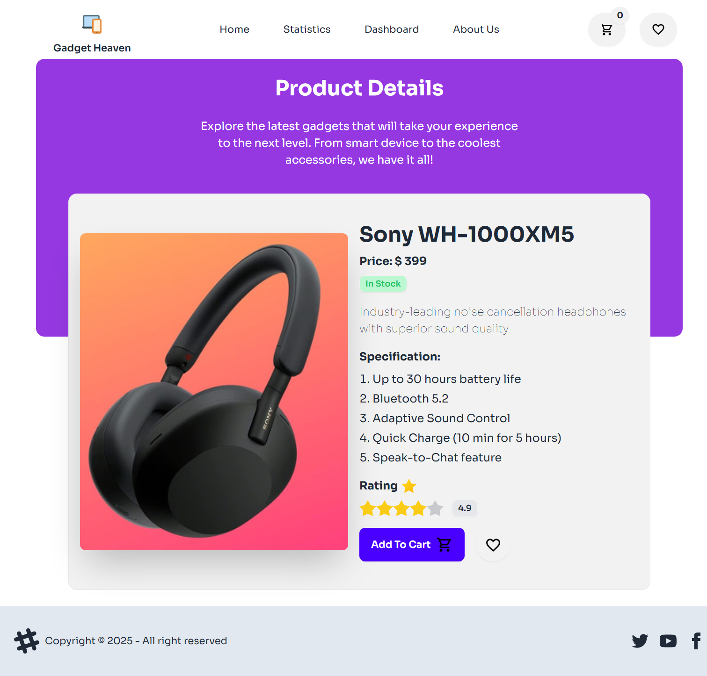

# Gadget Heaven✨

## Project Name: Gadget Heaven

### A brief description: 
- The Gadget Heaven project is an interactive, single-page e-commerce application designed to showcase a variety of electronic gadgets and simplify the shopping experience for users. Built with React, this project leverages React Router for smooth, multi-page navigation without page reloads, and employs localStorage as the main tool for data management, ensuring that users' shopping carts and preferences are preserved across sessions. The Context API is utilized specifically to update and display the cart item count in the navbar in real time, enhancing the usability and interactivity of the interface.

---
### Main Technology used in this project:
- Frontend Framework: React is utilized to construct an interactive, single-page e-commerce application, ensuring a dynamic user experience.
- Routing: React Router is implemented to facilitate seamless, multi-page navigation without necessitating full page reloads.
- State Management: The Context API is employed to manage and propagate state across the application efficiently.
- Styling: Tailwind CSS is adopted for crafting a responsive and aesthetically pleasing user interface.
- Build Tool: Vite is utilized as the build tool to enhance development speed and performance.
- Package Management: NPM is used for managing project dependencies and scripts.

### React fundamental concepts used in this project:

- Components: The building blocks of this project, breaking down the UI into reusable parts like NavBar, ProductCard, Cart, and Dashboard.
-  Props: Used to pass data and configuration from parent components to child components, such as passing product details to ProductCard or cart data to CartItem.
-  State: Used to manage data within components, particularly for dynamic content like cart items, product lists, and filters. React’s useState hook is likely used here.
-  React Router: Enables navigation across different pages (e.g., home, products, cart) without reloading the page, giving the application an SPA (Single Page Application) feel.
-  Context API: Used for managing global state, specifically for sharing the cart count in the navbar across multiple components, ensuring consistency in displaying the cart item number.
-  Data Persistence with localStorage: Storing data persistently in localStorage, enabling users to retain their cart items and preferences across sessions.

### What I've used for handling and managing data (context API/local storage):

- In this project, I've opted for localStorage as the primary tool for handling and managing data. This choice ensures that key data, like cart items and their details, persist across page reloads and even browser sessions, allowing users to keep their selections intact without needing to log in again or reselect items.
- Context API is also utilized, but its role is specifically for displaying the cart item count in the navbar, ensuring real-time updates whenever items are added or removed. This approach maintains efficiency by keeping only essential data in memory while relying on localStorage for more extensive data handling.

### Main Key Features of This Project:

- Multi-Page Navigation with React Router: Use React Router to set up multi-page navigation. Create routes for pages like "Home," "Products," "Cart," and "Profile," enhancing user navigation without reloading the page.
- Active Links with React NavLink: Use NavLink to highlight the active page in the navigation bar, giving users a clear indication of their current page. This will provide a smooth and visually engaging experience.
- Dynamic Data Visualization with React Recharts: Integrate Recharts to display sales statistics, product popularity, or user demographics through visual charts. The charts could be used on the dashboard or analytics pages to give users or admins insights at a glance.
- Product Details and Cart Pages via Route Parameters: Set up routes with parameters for products (e.g., /product/:id) and cart items, enabling users to view specific details for each product without relying on location. This can simplify navigation and URL management for detailed views.
- Category-Based Product Display: Use nested routes to show products based on categories (e.g., /products/laptops, /products/phones). This feature can let users easily navigate between categories using a dynamic and structured routing setup.

### Dependencies
- localforage: ^1.10.0
- match-sorter: ^7.0.0
- react: ^18.3.1
- react-dom: ^18.3.1
- react-helmet-async: ^2.0.5
- react-hot-toast: ^2.4.1
- react-responsive-modal: ^6.4.2
- react-router-dom: ^6.27.0
- recharts: ^2.13.3
- sort-by: ^0.0.2

### How to run on local machine?
1. Open your terminal or command prompt.

2. Use the git clone command followed by the repository URL:-  git clone 'repository-url'

- Replace 'repository-url' with the actual URL of the Git repository you want to clone.

3. To run the project: Navigate to the project directory:- cd 'directory-name' 

4. Run 'npm run dev' to run the project locally.

##  Live Link: 
### 1. Netlify : [Gadget Heaven](https://gadget-heaven-rrishiddh.netlify.app/)
### 2. Surge : [Gadget Heaven](https://gadget-heaven-rrishiddh.surge.sh/)

##  Site Preview: 
 

  
   
  

